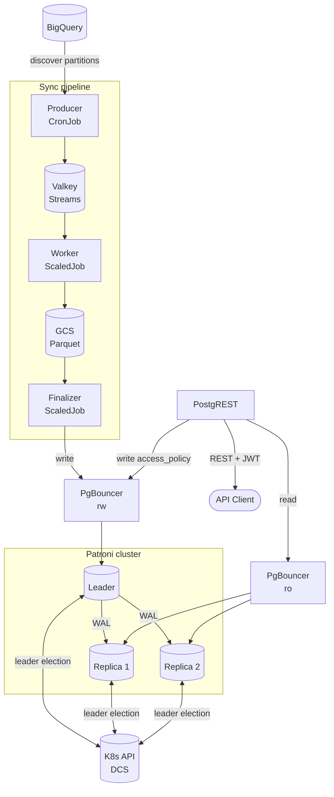

# Architecture

## Serving Layer

The product is a PostgreSQL database that uses the pg\_duckdb extension. This database mirrors a set of BigQuery tables. PostgREST serves this data as a REST API.

BigQuery is the source of truth. pg\_duckdb is a read cache. Clients query pg\_duckdb over HTTP. Clients never query BigQuery directly.

pg\_duckdb embeds DuckDB's columnar engine inside PostgreSQL. This lets the finalizer read Parquet files straight from GCS. The finalizer loads these files into native PostgreSQL tables in one process. Data Proxy needs no separate ETL engine for this step. Everything downstream of the load stays ordinary PostgreSQL. PostgREST, row-level security, and roles all work as they would against any other PostgreSQL database.

The read path does not enable DuckDB execution (`duckdb.force_execution`). PostgREST's read workload is small: filtered, index-driven lookups. DuckDB's columnar engine accelerates large scans and aggregations instead. Routing reads through DuckDB gives no benefit here.

The `pre_request` function mirrors every JWT claim into a PostgreSQL session variable. Row-level security policies compare the configured identity claim against grants in `rls.access_policy`. See [Security](security.md) for details.

The sync pipeline below keeps pg\_duckdb up to date with BigQuery. This pipeline runs outside the request path.

## Data sync

The sync pipeline has three components:

- **Producer** — runs as a Kubernetes CronJob. On each run, it reads the sync configuration. It compares every table's BigQuery modification signature against the last successful sync. It publishes tasks only for changed tables. It writes the sync plan to Valkey. The pod exits once it publishes the plan.
- **Worker** — runs as a KEDA ScaledJob. KEDA scales Job pods from two triggers on the `dp:sync:tasks` stream. `lagCount` counts unread messages. `pendingEntriesCount` counts messages delivered but not yet acknowledged. A pod counts as active until it acknowledges its messages. KEDA scales up to `maxReplicaCount` pods. Each pod handles up to `WORKER_MAX_RECORDS` tasks. Each pod writes its tasks as Parquet files to Google Cloud Storage. Each pod then keeps running until one of two events: the finalizer broadcasts a shutdown signal after the last task in the sync run completes, or the pod reaches `activeDeadlineSeconds`. Pods scale to zero between sync runs.
- **Finalizer** — runs as a KEDA ScaledJob. Only one finalizer pod runs at a time. It loads only the exact Parquet paths recorded in the sync plan. It publishes the changed tables to PostgreSQL as one atomic operation. It commits the new signatures. It signals PostgREST to reload its schema cache.

The producer skips a BigQuery table that has not changed since its last successful sync. The producer checks this with a modification signature. This signature combines the BigQuery modification time with the table's synchronization configuration. A configuration change therefore also forces a resync.

A table's strategy sets how many tasks the producer publishes for it. The `full` strategy publishes one task for the whole table. The `partitioned` strategy publishes one task per changed physical partition. See [Sync Configuration](sync.md) for the full reference.

The finalizer commits signatures only after it publishes successfully. A loss of Valkey state causes a full resync. This is safe. BigQuery stays the source of truth at all times.

## Modes

### Standalone

Use standalone mode for development. Use standalone mode for single-region deployments.

### High Availability

Use HA mode for production. Patroni manages a three-node PostgreSQL cluster. PgBouncer sends write traffic to the leader. PgBouncer sends read traffic to the replicas. The Kubernetes API serves as the distributed configuration store (DCS).

