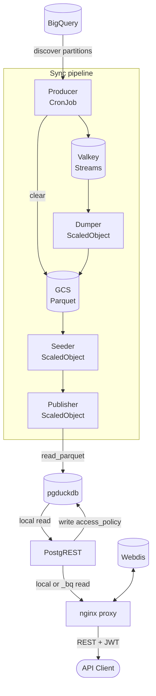
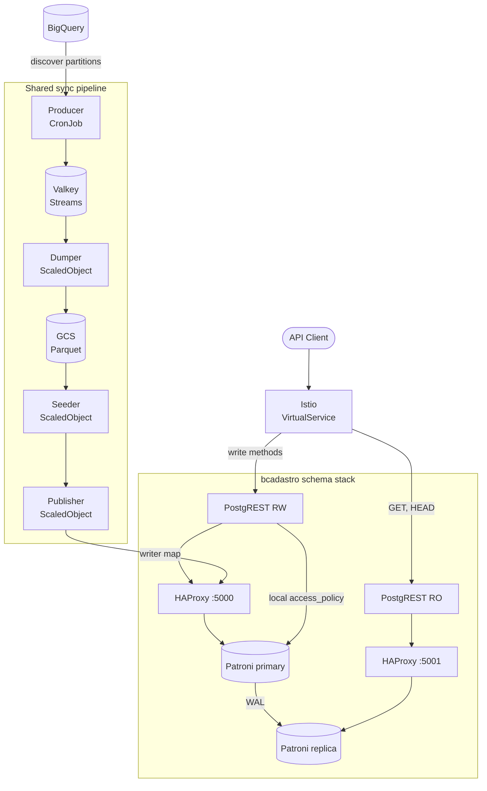

# Architecture

## Serving Layer

The product uses PostgreSQL with the pg_duckdb extension. This database mirrors selected BigQuery tables. PostgREST serves local data. An nginx proxy is the public read endpoint.

BigQuery is the source of truth. PostgreSQL is the normal read source. The proxy reads local PostgREST first. When an enabled fallback table returns no rows locally, the proxy queries its BigQuery-backed `_bq` view through PostgREST. Clients never call BigQuery directly.

Webdis stores non-empty JSON fallback and local responses. The proxy uses identity-aware cache keys. PostgREST validates JWTs and applies row-level security to both local tables and `_bq` views. See [BigQuery Fallback](fallback.md) for the request flow and cache rules.

pg_duckdb embeds DuckDB's columnar engine inside PostgreSQL. This lets the Publisher read Parquet files straight from GCS. The Publisher loads these files into native PostgreSQL tables in one process. Data Proxy needs no separate ETL engine for this step. Everything downstream of the load stays ordinary PostgreSQL. PostgREST, row-level security, and roles all work as they would against any other PostgreSQL database.

The read path does not enable DuckDB execution (`duckdb.force_execution`). PostgREST's read workload is small: filtered, index-driven lookups. DuckDB's columnar engine accelerates large scans and aggregations instead. Routing reads through DuckDB gives no benefit here.

The `pre_request` function mirrors every JWT claim into a PostgreSQL session variable. Row-level security policies compare the configured identity claim against grants in the local `<schema>.access_policy` table. See [Security](security.md) for details.

The sync pipeline runs outside the request path.

## Data sync

The sync pipeline has four components. Each component writes structured log records with context fields. Search logs with `run_id`, `table`, or `schema`.

- **Producer** — runs as a Kubernetes CronJob. It creates the Dumper, Seeder, and Publisher consumer groups. It reads the sync configuration. It compares each BigQuery table signature with the last successful signature. It publishes tasks only for changed tables. It deletes all objects from the GCS bucket before it publishes the tasks. It writes one sync plan to Valkey. The plan contains a list of publication plans, one for each affected PostgreSQL schema. The pod exits after it publishes the plan and tasks.
- **Dumper** — runs as a KEDA ScaledObject. KEDA uses two triggers on the `dp:extract` stream. `lagCount` counts unread messages. `pendingEntriesCount` counts messages that a Dumper received but did not acknowledge. KEDA runs a maximum of `maxReplicaCount` pods. Each pod processes one table or partition task. It writes one Parquet file to Google Cloud Storage, records the result in Valkey, and exits. The number of pods decreases to zero between sync runs.
- **Seeder** — runs as a KEDA ScaledObject. KEDA scales on the `dp:prepare` stream. The last Dumper publishes one seed task to `dp:prepare` when all extraction tasks complete. The Seeder reads the sync plan, initializes PostgreSQL schemas and roles, and publishes one publication task per schema to `dp:publish`. The pod exits after it dispatches the publication tasks.
- **Publisher** — runs as a KEDA ScaledObject. It reads one schema plan from the run plan hash. It uses the configured writer for that schema. For full rebuilds, it creates a shadow table from all Parquet files in the GCS bucket with a glob pattern. For incremental syncs, it deletes and loads only the changed partitions. It publishes changed tables and commits successful `TableState` values. The last Publisher tells PostgREST to reload its schema cache. A second subscription reclaims pending messages after `PUBLISHER_VISIBILITY_TIMEOUT_MS`.

The producer skips a BigQuery table that has not changed since its last successful sync. The producer checks this with a modification signature. This signature combines the BigQuery modification time with the table's synchronization configuration. A configuration change therefore also forces a resync.

A table's strategy sets how many tasks the producer publishes for it. The `full` strategy publishes one task for the whole table. The `partitioned` strategy publishes one task per changed physical partition. See [Sync Configuration](sync.md) for the full reference.

A Publisher crash leaves its message pending. A new Publisher pod reclaims the message after the visibility timeout. It then completes the run. The producer re-publishes a Publisher message when all tasks are complete and no Publisher message is pending. This recovers a message that no Publisher received.

The Dumper records the path of each failed extraction task. The Publisher publishes the successful parts of an incremental partition update. It keeps old data for a failed existing partition. It does not add data for a failed new partition. The committed manifest describes the data that PostgreSQL serves. As a result, the next producer run schedules each failed partition again.

A full table is atomic. A partitioned full rebuild is also atomic. One extraction failure blocks publication of the complete table. A preparation failure also blocks state commit for that table. A publication failure has the same effect.

Each configured schema has a `freshness` table. This table gives the last publication time. It also gives the result of the latest attempt. For full rebuilds, the Publisher updates freshness in the same transaction as the data-table swap. For incremental syncs, the Publisher updates freshness after it loads the changed partitions.

## Modes

### Standalone

Use standalone mode for development. Use standalone mode for single-region deployments.

### High Availability

HA mode creates one independent Patroni and HAProxy stack for each configured application schema. Patroni uses the Kubernetes API as its distributed configuration store (DCS). HAProxy port `5000` sends PostgreSQL connections to the current primary. HAProxy port `5001` sends connections to replicas.

Publication is atomic inside one schema database. It is not atomic across independent schema databases. If one schema publishes and a later schema fails, the Publisher does not commit synchronization state. A retry can publish an already-published schema again. Publication operations must remain idempotent.

