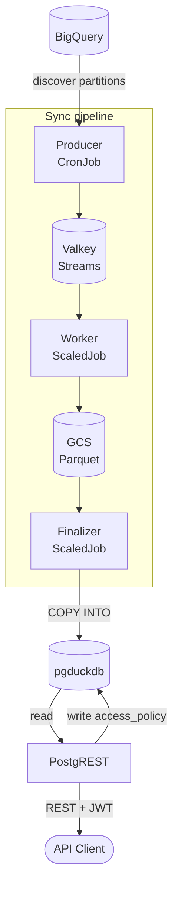

# Architecture

## Serving Layer

The product is a PostgreSQL database (pg\_duckdb) that mirrors a set of BigQuery tables, served through PostgREST as a REST API. BigQuery remains the authoritative data store; pg\_duckdb is a disposable, eventually consistent read cache that clients query over HTTP instead of querying BigQuery directly.

pg\_duckdb embeds DuckDB's columnar engine inside PostgreSQL, so the finalizer can read Parquet files straight from GCS and load them into native PostgreSQL tables in one process, without a separate ETL engine. Everything downstream of that load stays ordinary PostgreSQL: PostgREST, row-level security, and roles all work exactly as they would against any other PostgreSQL database.

DuckDB execution (`duckdb.force_execution`) is not enabled for the read path. PostgREST's read workload is small, filtered, index-driven lookups, not the large scans and aggregations DuckDB's columnar engine is built to accelerate, so there is nothing to gain from routing reads through it.

The `pre_request` function mirrors every JWT claim into a PostgreSQL session variable. Row-level security policies compare the configured identity claim against grants in `rls.access_policy` (see [Security](security.md)).

The sync pipeline described below is what keeps pg\_duckdb up to date with BigQuery; it is not part of the request path.

## Data sync

The sync pipeline has three components:

- **Producer** — runs as a Kubernetes CronJob. On each run it reads the sync configuration, compares every table's BigQuery modification signature against the last successful sync, and publishes tasks only for changed tables. It also writes the sync plan to Valkey. The pod exits when the plan is published.
- **Worker** — runs as a KEDA ScaledJob. KEDA scales Job pods from two triggers on the `dp:sync:tasks` stream: `lagCount` (unread messages) and `pendingEntriesCount` (messages delivered but not yet acknowledged, which keeps a pod counted as active while it finishes processing), up to `maxReplicaCount` pods. Each pod handles up to `WORKER_MAX_RECORDS` tasks, writes them as Parquet files to Google Cloud Storage, then keeps running until the finalizer broadcasts a shutdown signal (once the last task in the sync run completes) or `activeDeadlineSeconds` is reached. Pods scale to zero between sync runs.
- **Finalizer** — runs as a KEDA ScaledJob. Only one finalizer pod runs at a time. It loads only the exact Parquet paths recorded in the sync plan, atomically publishes the changed tables to PostgreSQL, commits the new signatures, and signals PostgREST to reload its schema cache.

When a BigQuery table has not changed since its last successful sync, the producer skips it. The producer compares a modification signature that combines the BigQuery modification time with the table's synchronization configuration. A configuration change therefore also forces a resync.

A table's strategy determines how many tasks the producer publishes for it: `full` publishes one task for the whole table, while `partitioned` publishes one task per changed physical partition. See [Sync Configuration](sync.md) for the full reference.

Signatures are committed only after the finalizer publishes successfully. Losing Valkey state causes a full resync, which is safe because BigQuery remains authoritative.

## Modes

### Standalone

Use standalone mode for development and single-region deployments.

### High Availability

Use HA mode for production. Patroni manages a three-node PostgreSQL cluster. PgBouncer separates write traffic (to the leader) from read traffic (to the replicas). The Kubernetes API serves as the distributed configuration store (DCS).

