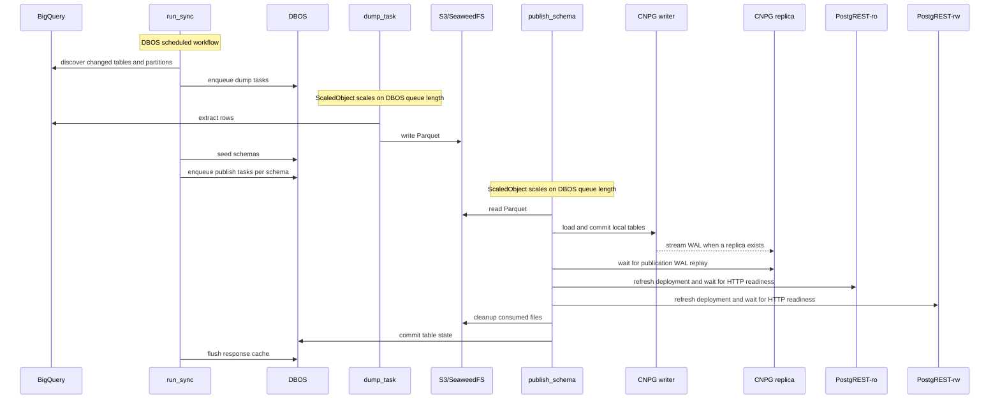
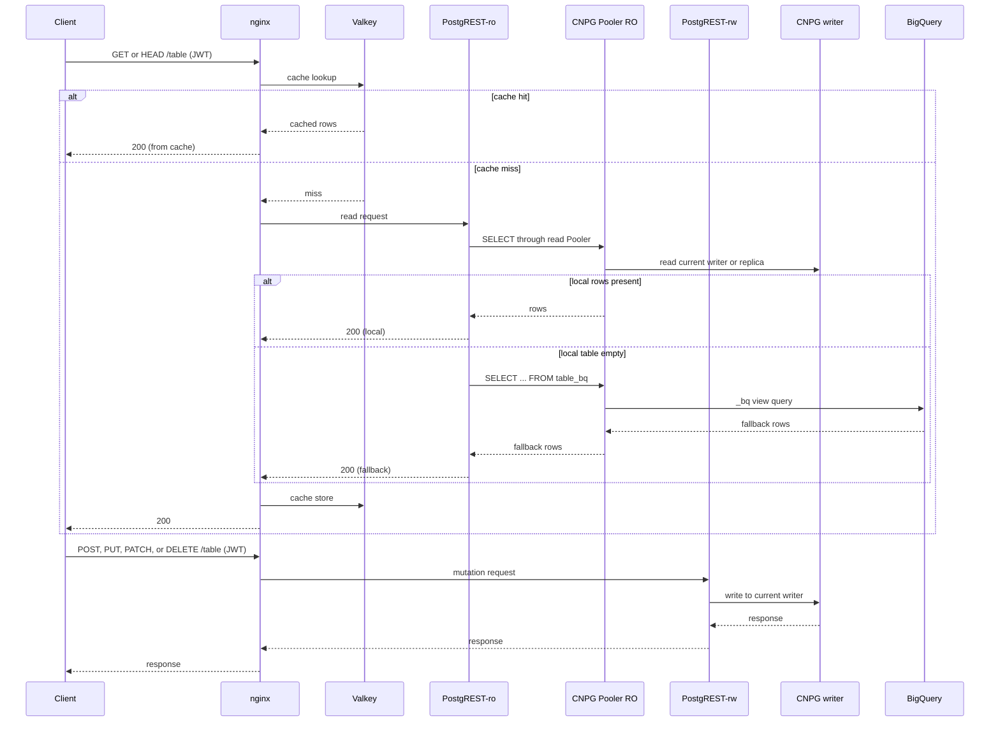
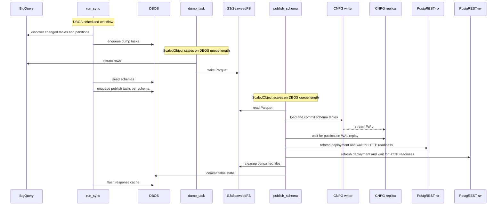
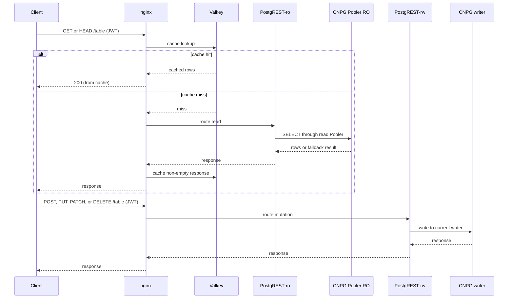

# Architecture

## Serving layer

BigQuery is the source of truth. PostgreSQL is the normal read store. PostgREST exposes synced tables. When fallback is enabled, nginx reads local PostgREST first and then reads the BigQuery-backed `_bq` view only for an empty local `GET` response.

Parquet files live in an S3-compatible object store. The chart default is SeaweedFS. PostgreSQL uses the pg_duckdb extension to read the files during publication. Clients never call BigQuery directly.

Webdis caches non-empty JSON responses with identity-aware keys. PostgREST validates JWTs and applies the same row-level security to local tables and `_bq` views. See [Fallback](fallback.md) and [Security](security.md).

## Sync pipeline

| Component | Work                                              | Result                                                              |
| --------- | ------------------------------------------------- | ------------------------------------------------------------------- |
| run_sync  | Detect changed tables and partitions.             | Enqueues dump tasks to the DBOS dump queue.                       |
| dump_task | Extract one full table or one partition batch.    | Writes one Parquet file and returns the result.                     |
| seed      | Initialize configured schemas and policy objects. | Runs inside run_sync before the publish fan-out.                    |
| publish_schema | Load, prepare, and publish one schema.       | Commits table state and refreshes PostgREST after the final schema. |

The Producer includes configuration in a table signature. A configuration change therefore causes a resync.

A partition batch contains changed partitions up to the configured size and count limits. One batch produces one Parquet file. See [Sync](sync.md).

Full tables and partitioned full rebuilds publish atomically. An incremental update keeps old data for a failed existing partition and omits a failed new partition. The next run schedules failed partitions again.

## Modes

### Standalone

Use standalone mode for development and single-region deployments.

#### Sync

#### Request

### High Availability

CNPG manages PostgreSQL instances, replication, failover, and lifecycle. In shared mode, one CNPG Cluster serves all configured schemas. In per-schema HA mode, each configured schema has its own CNPG Cluster, read Pooler, nginx proxy, and PostgREST-ro/rw pair.

The DBOS system database holds all sync workflow state and the `dp` application schema (table signatures, partition manifests, errors). In single mode it runs in the shared CNPG cluster. In HA mode DBOS gets its own CNPG cluster with one primary and one replica and no pooler.

Nginx routes `GET` and `HEAD` requests to PostgREST-ro through the CNPG read Pooler. Mutations route to PostgREST-rw, which connects directly to the current CNPG writer. The read Pooler is transaction-pooled and is not used by sync workers or PostgREST writes.

The Publisher commits database state, waits for standby WAL replay, refreshes both PostgREST deployments, and waits for their HTTP readiness probes before it completes publication and flushes the response cache. Publication revokes anonymous access on each schema writer. Finalization only clears the temporary object store and response cache. `/access_policy` is never response-cached.

#### Sync

#### Request

Publication is atomic inside one schema database. It is not atomic across independent schema databases. If one schema publishes and a later schema fails, the Publisher does not commit synchronization state. A retry can publish an already-published schema again. Publication operations must remain idempotent.

### Mode migration

A shared-to-per-schema or per-schema-to-shared change is a normal Helm upgrade. During the post-upgrade migration hook, Helm retains the source topology, initializes the target, copies each configured schema with idempotent `pg_dump`/`pg_restore`, and records the result in `data-proxy-mode-state`. A later reconciliation prunes the retained source resources.

A failed migration keeps the source available for retry. Do not manually delete CNPG or application resources during a transition.

---

[Home](../README.md) · [Next →](sync.md)
