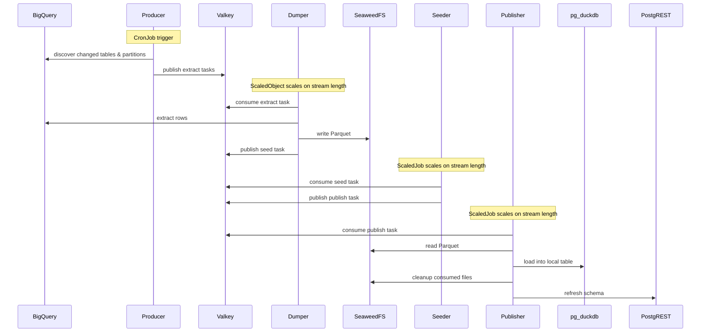
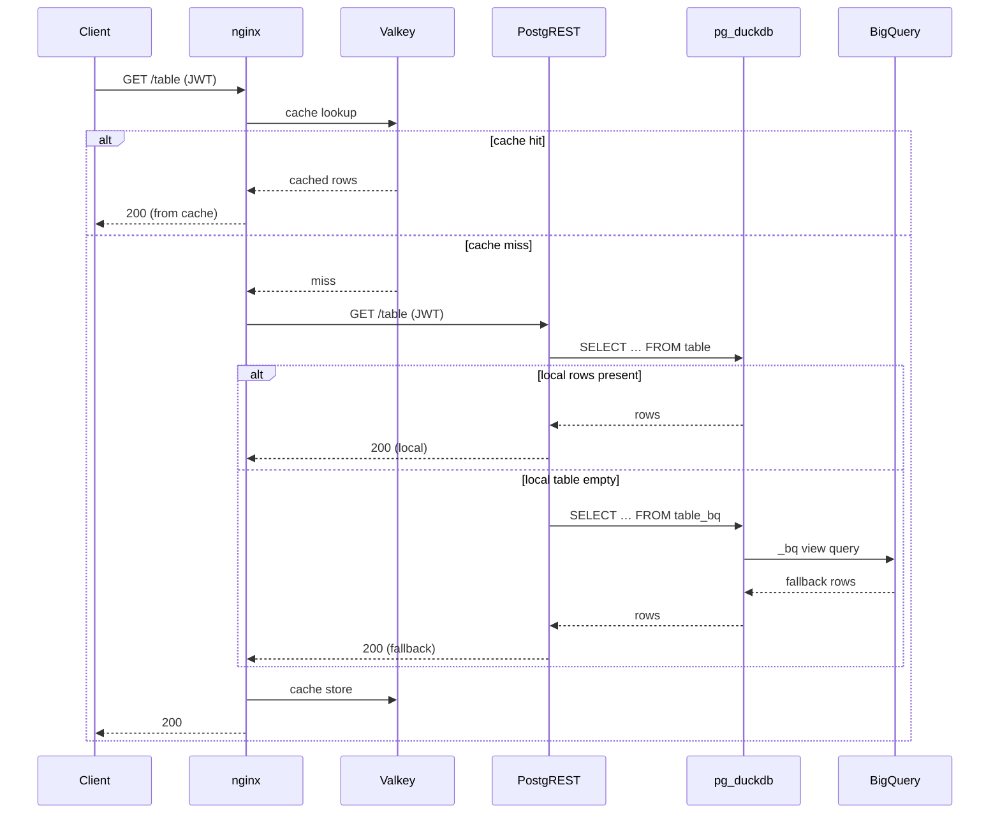
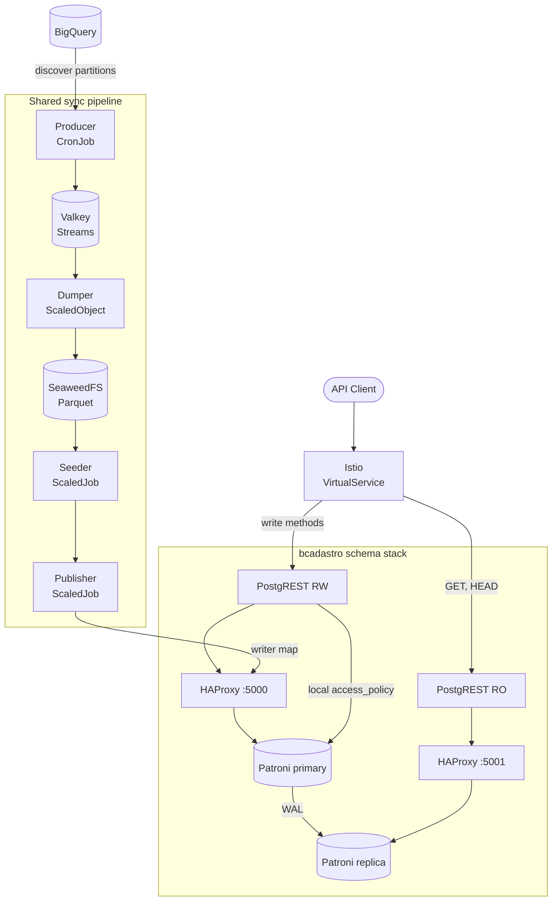

# Architecture

## Serving layer

BigQuery is the source of truth. PostgreSQL is the normal read store. PostgREST exposes synced tables. When fallback is enabled, nginx reads local PostgREST first and then reads the BigQuery-backed `_bq` view only for an empty local `GET` response.

Parquet files live in an S3-compatible object store. The chart default is SeaweedFS. pg_duckdb reads the files during publication. Clients never call BigQuery directly.

Webdis caches non-empty JSON responses with identity-aware keys. PostgREST validates JWTs and applies the same row-level security to local tables and `_bq` views. See [Fallback](fallback.md) and [Security](security.md).

## Sync pipeline

| Component | Work                                              | Result                                                              |
| --------- | ------------------------------------------------- | ------------------------------------------------------------------- |
| Producer  | Detect changed tables and partitions.             | Stores plans and publishes tasks to Valkey.                         |
| Dumper    | Extract one full table or one partition batch.    | Writes one Parquet file and records the result.                     |
| Seeder    | Initialize configured schemas and policy objects. | Publishes one schema task per plan.                                 |
| Publisher | Load, prepare, and publish one schema.            | Commits table state and refreshes PostgREST after the final schema. |

The Producer includes configuration in a table signature. A configuration change therefore causes a resync.

A partition batch contains changed partitions up to the configured size and count limits. One batch produces one Parquet file. See [Sync](sync.md).

Full tables and partitioned full rebuilds publish atomically. An incremental update keeps old data for a failed existing partition and omits a failed new partition. The next run schedules failed partitions again.

## Modes

### Standalone

Use standalone mode for development and single-region deployments.

### High Availability

HA mode creates one independent Patroni and HAProxy stack for each configured application schema. Patroni uses the Kubernetes API as its distributed configuration store (DCS). HAProxy port `5000` sends PostgreSQL connections to the current primary. HAProxy port `5001` sends connections to replicas.

Publication is atomic inside one schema database. It is not atomic across independent schema databases. If one schema publishes and a later schema fails, the Publisher does not commit synchronization state. A retry can publish an already-published schema again. Publication operations must remain idempotent.

---

[Home](../README.md) · [Next →](sync.md)
