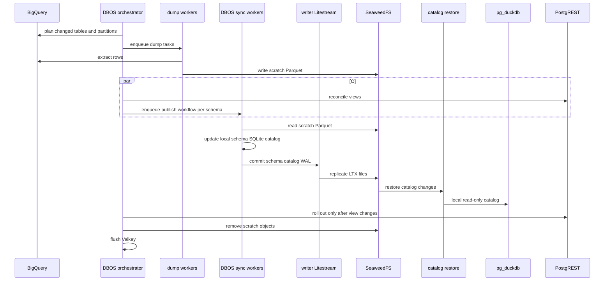
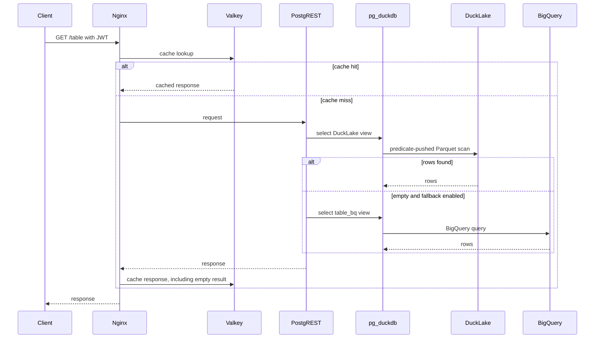

# Architecture

## Serving layer

BigQuery is the source of truth. The sync service extracts data to Parquet in SeaweedFS. DuckLake stores the table metadata in one SQLite catalog per PostgreSQL schema and stores table data as Parquet in SeaweedFS.

PostgreSQL stores metadata only:

- roles and grants;
- `access_policy` and `access_log`;
- PostgreSQL views and `SECURITY DEFINER` functions;
- DBOS workflow state.

PostgREST reads the DuckLake-backed views. The functions build the access-policy predicate and pass it to DuckDB, so filters are pushed into Parquet scans. Each table also has an optional `_bq` fallback view.

Nginx and Valkey handle response caching. The read order is:

```text
Valkey cache
→ PostgREST DuckLake view
→ PostgREST BigQuery (_bq) view
→ Valkey cache result
```

Empty responses are cached for one hour by default.

## Catalog replication

The DBOS sync workers update one shared writer catalog volume. One Litestream sidecar replicates all SQLite catalogs to SeaweedFS:

```text
DuckLake writer
→ local /var/lib/ducklake/catalogs/<schema>/catalog.sqlite
→ Litestream replicate
→ SeaweedFS LTX replica
```

The `data-proxy-litestream` Deployment restores every schema catalog into a shared reader volume. CNPG PostgreSQL instances mount that volume read-only:

```text
SeaweedFS LTX replica
→ Litestream restore -f
→ local read-only catalog
→ pg_duckdb
```

The restore container writes the reader volume. PostgreSQL and pg_duckdb open it read-only. pg_duckdb re-reads the catalog file on every query.

There is one active writer per schema catalog. Publishing is parallel across schemas and sequential within each schema queue.

## Sync service

| Component | Work | Result |
| --- | --- | --- |
| `run_sync` | Plans changed tables and partitions. | Enqueues dump and publish workflows. |
| `dump_task` | Extracts BigQuery data. | Writes independent scratch Parquet files. |
| `seed_schemas` | Reconciles PostgreSQL functions and views. | Returns whether the view set changed. |
| `publish_schema` | Inserts scratch Parquet into the local DuckLake catalog. | Litestream replicates the catalog changes. |
| `expire_catalogs` | Expires old DuckLake snapshots on the sync workers. | Removes unreferenced old Parquet files. |
| `finalize_run` | Clears scratch objects and Valkey. | Keeps the DuckLake data prefix intact. |

Seed and publish run concurrently. PostgREST rolls out only when a view is added or removed. A normal data snapshot does not require a PostgREST rollout.

## Sync sequence



## Kubernetes topology

The chart deploys one CNPG cluster, one session-mode Pooler, one PostgREST read workload, one proxy workload, and one `data-proxy-litestream` Deployment. KEDA scales the DBOS sync workers, which share the writer catalog volume. PostgreSQL replicas transfer metadata through normal CNPG WAL; they do not receive application table rows.

The `data-proxy-litestream` Deployment has one restore container for the reader volume and one replication sidecar for the writer volume. It uses a Recreate strategy so only one Litestream process writes each direction.

## Request sequence



---

[Home](../README.md) · [Next →](sync.md)
