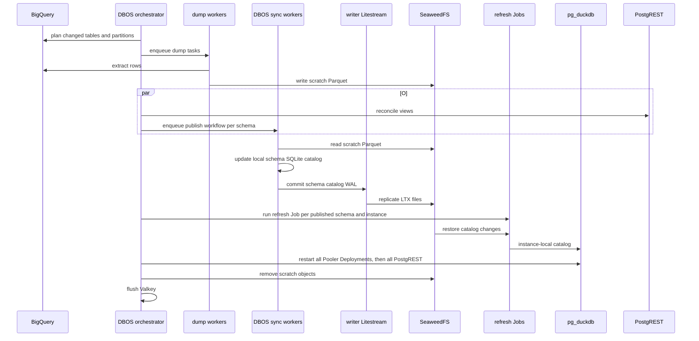
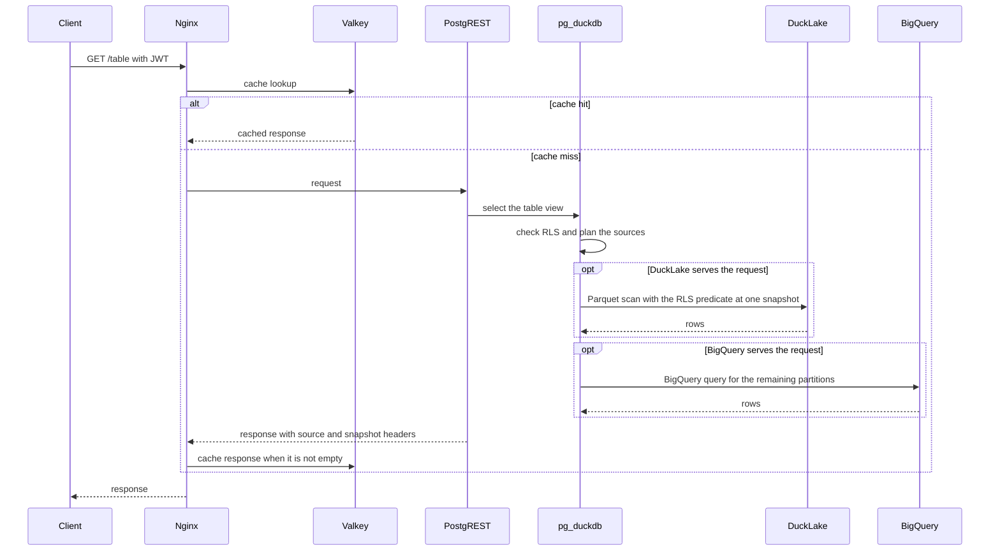

# Architecture

## Serving layer

Each PostgreSQL schema has one configured ingestion source. BigQuery is the default and current source. The sync service extracts source data to Parquet in SeaweedFS. DuckLake stores the table metadata in one SQLite catalog per PostgreSQL schema and stores table data as Parquet in SeaweedFS.

PostgreSQL stores metadata only:

- roles and grants;
- `access_policy` and `access_log`;
- PostgreSQL views and `SECURITY DEFINER` functions;
- DBOS workflow state.

PostgREST reads one view per table. The view calls a function that checks the access policy, plans DuckLake and the optional configured-source partition fallback from `data_proxy.state`, and reads them. The function passes the access-policy predicate to DuckDB, so the Parquet scan reads only authorized rows. PostgREST query filters aren't pushed into DuckDB. PostgreSQL applies them after the function returns the authorized rows.

The proxy and Valkey handle response caching. The read order is:

```text
Valkey cache
→ PostgREST table view (DuckLake, and each configured fallback source in order)
→ Valkey cache result, when the answer is not empty
```

See [Proxy](proxy.md) for the routing rules and the cache.

## Catalog replication

The DBOS sync workers update the catalogs in `/ducklake/<schema>/catalog.sqlite` on the shared `data-proxy-duckdb` volume. The same volume holds the DuckDB secrets in `/duckdb/secrets`, which only PostgreSQL pods mount. One writer-only Litestream container replicates all SQLite catalogs to SeaweedFS:

```text
DuckLake writer
→ local /var/lib/ducklake/catalogs/<schema>/catalog.sqlite
→ Litestream replicate
→ SeaweedFS LTX replica
```

Every PostgreSQL Pod has its own generic ephemeral catalog volume. The Pod starts one official Litestream init container per schema. Each container runs `litestream restore -if-replica-exists`, so a new cluster with an empty replica starts normally, and a new or replaced Pod restores the latest catalogs:

```text
SeaweedFS LTX replica
→ init container: litestream restore -if-replica-exists
→ instance-local catalog volume
→ pg_duckdb
```

A PostgreSQL backend keeps its DuckLake attachment, so it can keep an old catalog view. After all schema publishers finish, checkpointed workflow steps refresh the running instances without restarting PostgreSQL:

1. `detect_published_schemas` keeps only the schemas that published a snapshot.
2. `list_serving_deployments` and `list_instance_claims` list the Pooler and PostgREST Deployments by label and the volume claim of every ready PostgreSQL instance.
3. The `refresh_catalog` child workflow runs once for every published schema and instance, on a queue that limits how many run at once. Each run copies the chart's `data-proxy-refresh-catalog-<schema>` Job, sets the claim of one instance, and waits for it with a Kubernetes watch. The Job runs `litestream restore -force` and replaces `catalog.sqlite` in place. The workflow deletes the Job when it ends, because a finished Job pod keeps the instance volume claim in use and blocks the replacement of the PostgreSQL Pod.
4. `find_lagging_snapshots` reads the snapshot that the primary reports for each published schema. Litestream replicates a few seconds after a commit, so a Job that starts too early restores an older catalog. The workflow then waits `READER_REFRESH_RETRY_SECONDS` and runs the Jobs again for the lagging schemas, up to `READER_REFRESH_ATTEMPTS` times.
5. Restart all Pooler Deployments together and wait until all are ready, then restart all PostgREST Deployments together and wait.

New Pooler connections open new backends, which attach the refreshed catalog.

There is one active writer per schema catalog. Publishing is parallel across schemas and sequential within each schema queue.

## Sync service

| Component | Work | Result |
| --- | --- | --- |
| `run_sync` | Plans changed tables and partitions. | Enqueues dump and publish workflows. |
| `dump_task` | Extracts ingestion-source data. | Writes independent scratch Parquet files. |
| `seed_schemas` | Reconciles PostgreSQL functions and views. | Returns whether the view set changed. |
| `publish_schema` | Inserts scratch Parquet into the local DuckLake catalog. | Litestream replicates the catalog changes. |
| `apply_ducklake_maintenance` | Runs inside `publish_schema` on the schema writer after a publication. | Expires old snapshots, compacts files, and removes old and orphaned Parquet files. |
| `refresh_catalogs` | Runs one refresh Job per published schema and instance. | Every instance catalog has the new snapshot. |
| `finalize_run` | Clears scratch objects and Valkey. | Keeps the DuckLake data prefix intact. |

Seed and publish run concurrently. After a published snapshot, the workflow refreshes catalogs and restarts all Pooler Deployments and then all PostgREST Deployments. PostgREST also restarts when a view is added or removed.

## Sync sequence


```mermaid
sequenceDiagram
    participant BQ as BigQuery
    participant O as DBOS orchestrator
    participant D as dump workers
    participant P as DBOS sync workers
    participant L as writer Litestream
    participant S3 as SeaweedFS
    participant R as refresh Jobs
    participant PG as pg_duckdb
    participant API as PostgREST

    O->>BQ: plan changed tables and partitions
    O->>D: enqueue dump tasks
    D->>BQ: extract rows
    D->>S3: write scratch Parquet
    par O
        O->>API: reconcile views
        O->>P: enqueue publish workflow per schema
    end
    P->>S3: read scratch Parquet
    P->>P: update local schema SQLite catalog
    P->>L: commit schema catalog WAL
    L->>S3: replicate LTX files
    O->>R: run refresh Job per published schema and instance
    S3->>R: restore catalog changes
    R->>PG: instance-local catalog
    O->>PG: restart all Pooler Deployments, then all PostgREST
    O->>S3: remove scratch objects
    O->>O: flush Valkey
```

## Kubernetes topology

The chart deploys one CNPG cluster, one session-mode Pooler, one PostgREST read workload, one proxy workload, and one writer-only `data-proxy-litestream` Deployment. With `ha.enabled`, the chart adds standbys, a read Pooler, and a read PostgREST. See [Helm Chart](helm_chart.md#single-and-ha-mode). KEDA scales the DBOS sync workers, which share the catalog volume. PostgreSQL replicas transfer metadata through normal CNPG WAL; they don't receive application table rows.

The `data-proxy-litestream` Deployment has one writer-only Litestream container. It uses a Recreate strategy so only one Litestream process replicates each catalog. PostgreSQL Pods restore catalogs in init containers, and the sync ServiceAccount can create and delete refresh Jobs and restart Deployments.

## Request sequence


```mermaid
sequenceDiagram
    participant C as Client
    participant N as Nginx
    participant V as Valkey
    participant API as PostgREST
    participant PG as pg_duckdb
    participant DL as DuckLake
    participant BQ as BigQuery

    C->>N: GET /table with JWT
    N->>V: cache lookup
    alt cache hit
        V-->>N: cached response
    else cache miss
        N->>API: request
        API->>PG: select the table view
        PG->>PG: check RLS and plan the sources
        opt DuckLake serves the request
            PG->>DL: Parquet scan with the RLS predicate at one snapshot
            DL-->>PG: rows
        end
        opt BigQuery serves the request
            PG->>BQ: BigQuery query for the remaining partitions
            BQ-->>PG: rows
        end
        API-->>N: response with source and snapshot headers
        N->>V: cache response when it is not empty
    end
    N-->>C: response
```

---

[Home](../README.md) · [Next →](sync.md)
