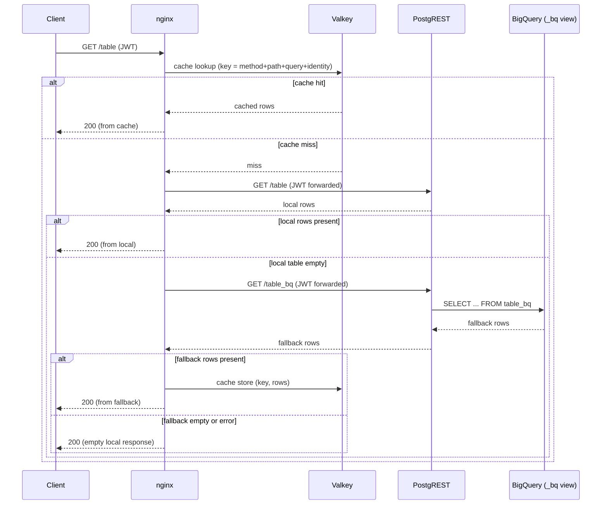

# Fallback

Fallback serves an empty local `GET` from the BigQuery-backed `<table>_bq` view. Clients keep using the normal table endpoint.

Enable it with:

```yaml
fallback:
  enabled: true
```

The chart deploys nginx and Valkey. nginx is the public endpoint. GET and HEAD requests use PostgREST-ro through the read Pooler; mutations use PostgREST-rw directly through the current writer. PostgREST remains the local API endpoint.

## Request flow



Fallback applies to reads only. The proxy does not cache empty, ranged, write, oversized, or non-JSON responses. `/access_policy` and its subpaths are never read from or written to the response cache, regardless of schema profile.

## Access and cache scope

nginx forwards the JWT to PostgREST. Local tables and fallback views use the same schema and row conditions.

Cache keys include request method, path, query, schema profile, representation headers, and identity claims. Different identities do not share entries.

Configure fallback values in [Helm Chart](helm_chart.md#bigquery-fallback). API response headers are documented in [Using the API](using.md#response-source-and-cache).

---

[← Previous](security.md) · [Home](../README.md) · [Next →](keda.md)
