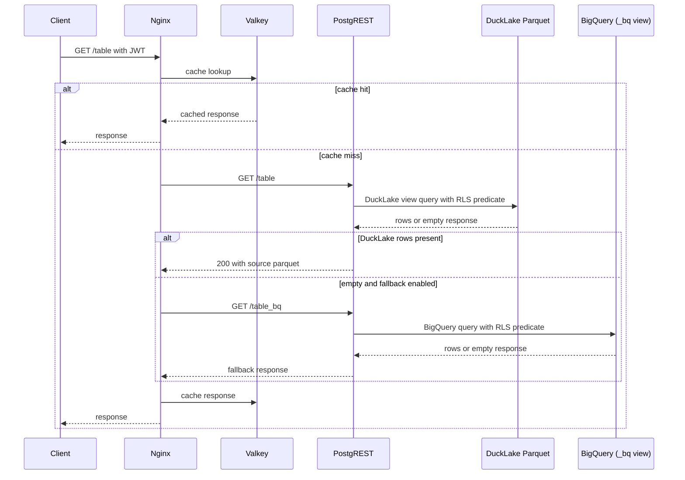

# Fallback

Fallback serves an empty DuckLake-backed `GET` from the BigQuery-backed `<table>_bq` view. Clients keep using the normal table endpoint.

Enable it with:

```yaml
fallback:
  enabled: true
```

The chart deploys Nginx and Valkey. Nginx is the public endpoint. Read requests use the PostgREST DuckLake view. Nginx only calls the `_bq` view when the DuckLake response is empty and fallback is enabled.

## Request flow



The fallback order is:

```text
Valkey cache
→ PostgREST DuckLake view
→ PostgREST BigQuery _bq view
→ Valkey cache result
```

Empty JSON responses are cached for `fallback.emptyCacheTtl` seconds. The default is one hour. This avoids repeated DuckLake and SeaweedFS reads for known-empty results.

Fallback applies to reads only. Nginx does not cache ranged, write, oversized, or non-JSON responses. `/access_policy` and its subpaths are never response-cached.

## Access and cache scope

Nginx forwards the JWT to PostgREST. DuckLake and BigQuery functions use the same schema and row-policy predicates.

Cache keys include request method, path, query, schema profile, representation headers, and identity claims. Different identities do not share entries.

Normal DuckLake responses use the `parquet` source label. BigQuery fallback responses use the BigQuery source label.

Configure fallback values in [Helm Chart](helm_chart.md#bigquery-fallback). API response headers are documented in [Using the API](using.md#response-source-and-cache).

---

[← Previous](security.md) · [Home](../README.md) · [Next →](keda.md)
