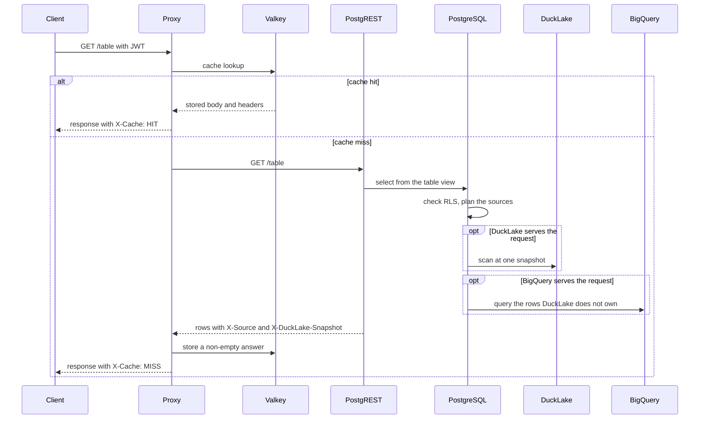

# Proxy

The proxy sits in front of PostgREST. It forwards requests and caches read responses. It doesn't choose where data comes from: PostgreSQL decides that for every request.

The chart deploys the proxy (nginx with a small script) and Valkey. Configure it under `proxy` in [Helm Chart](helm_chart.md#proxy).

## Request flow

## Choosing the source

The table view calls one function that applies these rules in order:

1. A request that pins a snapshot is read from DuckLake only.
2. A partitioned table that's not in `data_proxy.state` reads its configured source when `fallback` is true. Without fallback, the request gets a `404`.
3. A table in `data_proxy.state` reads DuckLake. A partitioned table with `fallback: true` also reads uncovered partitions from its configured source.

Row-level security runs first. A request that RLS stops reads no source and gets an empty list without `X-Source`.

An empty DuckLake result never triggers fallback. With `fallback: true`, every request also reads the configured source for partitions that DuckLake doesn't hold, because PostgREST applies filters after the function returns. Keep fallback disabled when that cost isn't acceptable.

## Cache

- Only non-empty `GET` answers with status 200 are stored. An empty answer can mean that access was denied, that data isn't published yet, or that a policy changed, so it's never stored.
- The key includes the method, path, query, schema profile, representation headers, pinned snapshot version, and identity claims. Different identities don't share entries.
- An entry stores the body with `X-Source` and `X-DuckLake-Snapshot`, so a cache hit reports what produced the answer. `X-Cache` tells a hit from a miss.
- nginx doesn't cache ranged, write, oversized, or non-JSON responses. `/access_policy` and its subpaths are never cached.
- The sync flushes the cache after each run.

See [Using the API](using.md#response-source-and-cache) for the response headers.

---

[← Previous](security.md) · [Home](../README.md) · [Next →](keda.md)
