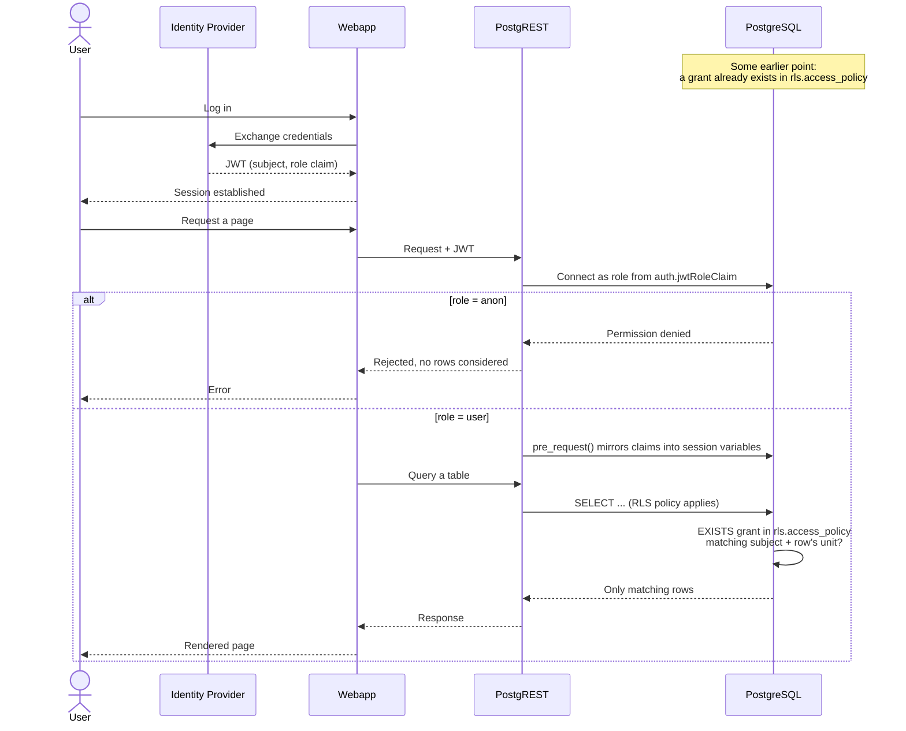

# Security

## Overview

Every request goes through the same four stages:

1. **Authenticate**: a client gets a JWT from your identity provider. The token identifies _who_ is asking, nothing more — it carries no table grants or unit memberships.
2. **Authorize the connection**: PostgREST maps a claim in the JWT (`auth.jwtRoleClaim`) to a PostgreSQL role: `anon` (no table access), `user` (table access, subject to RLS), or `policy_writer_<schema>` (write access to one schema's grants, no table access). Postgres enforces this with an ordinary `GRANT`/no-`GRANT` check before RLS is even considered — an `anon` token is rejected outright, not filtered to zero rows.
3. **Filter the rows**: for a `user` token, `pre_request()` mirrors every JWT claim into a session variable. Each protected table's RLS policy reads the claim configured for its schema (`schemas.<schema>.claim`) and checks it against `rls.access_policy` — a row is returned only if a matching grant exists.
4. **Grant or revoke**: access itself is data, not configuration. A backend service writes and deletes rows in `rls.access_policy` through PostgREST, authenticated as that schema's `policy_writer_<schema>` role. Nothing in Data Proxy computes who should see what — it only enforces what that table says.

Data Proxy never computes access decisions. It has no concept of a customer, a permission, or a business rule — just one generic table it checks before returning any row.

## Row-Level Security (RLS)

Every protected table checks its rows against one generic table, shared by every schema:

```sql
rls.access_policy(schema, subject, is_super_admin, unit_type, unit_id)
```

The Helm chart creates this table once, at cluster bootstrap. Each configured schema also gets its own `policy_writer_<schema>` role, created automatically the first time any of its tables syncs — along with the schema itself, if it does not already exist (see [Schema Creation](sync.md#schema-creation)).

A table opts into RLS by declaring, in its sync configuration, which of its own columns identify a unit of access:

```json
"rls": [
  { "column": "id_cras", "unit_type": "cras" },
  { "column": "id_escola", "unit_type": "escola" }
]
```

At sync time, this becomes one fixed policy per table:

```sql
CREATE POLICY access_policy_scoped ON my_schema.participants
USING (
    EXISTS (
        SELECT 1 FROM rls.access_policy AS p
        WHERE p.schema = 'my_schema'
          AND p.subject = current_setting('app.claim_preferred_username', true)
          AND (
            p.is_super_admin
            OR (p.unit_type = 'cras' AND p.unit_id = id_cras::text)
            OR (p.unit_type = 'escola' AND p.unit_id = id_escola::text)
          )
    )
)
```

A row is visible if the requesting subject has `is_super_admin = true`, or has a matching grant for _any_ of the table's declared units — a user with access to three CRAS units has three rows in `access_policy`, not three columns on their JWT.

## Flow

Take a user of a webapp built on top of Data Proxy, working at one unit (for example, one school).

1. **The user logs in**: the webapp's identity provider checks their credentials and issues a JWT. The token proves identity (a subject, matching whatever claim the schema is configured to read — for example `preferred_username`) and carries a role claim. It says nothing about which units the user can see; identity and access are unrelated at this point.
2. **The webapp sends that token to Data Proxy**: every request to the REST API includes the JWT in the `Authorization` header.
3. **PostgREST picks a PostgreSQL role from the token**: it reads the role claim (`auth.jwtRoleClaim`) and connects to Postgres as that role. If it resolves to `anon`, the request is rejected by a plain permission check before any table or row is considered. If it resolves to `user`, the connection proceeds and RLS becomes relevant.
4. **`pre_request()` mirrors the token's claims into session variables**: every claim in the JWT becomes a PostgreSQL session variable for the duration of the request, including the identity claim configured for that schema.
5. **Independently of all this, an access grant already exists**: at some earlier point — onboarding, a role change, anything — a backend service authenticated as `policy_writer_<schema>` wrote one row into `rls.access_policy`: this subject, this unit type, this unit id. That write has nothing to do with logging in; it can happen long before or long after any given login.
6. **The user's query runs against a table with RLS enabled**: for every row, Postgres evaluates the table's policy — does a row exist in `rls.access_policy` for this subject, matching this row's unit? Rows belonging to the granted school are returned; rows belonging to any other school are excluded, as if they were never in the table.
7. **Access changes without touching the login system**: if the grant from step 5 is deleted and a different one is written, the very next request reflects that change immediately — no new token, no resync, no cache to expire.



## Creating and Granting Access

This is the practical counterpart to the flow above: how to actually create a user and give it access to a unit.

### Create policy-writer service account

Every schema gets its own writer client, one client per schema. Before a token reaches PostgREST, Istio checks its `azp` (authorized party) claim against an allow-list, and the chart builds that list automatically from `syncConfig.schemas` — one entry per schema, named:

```
data-proxy.policy_writer.<schema>
```

using the schema name exactly as it appears in `syncConfig.schemas` (no case or character conversion). The schema `app_pequenos_cariocas` requires a client named exactly `data-proxy.policy_writer.app_pequenos_cariocas` — the chart matches against this name literally, so a typo here fails silently with no error pointing at the cause.

To create it:

1. Create a client named `data-proxy.policy_writer.<schema>`, confidential, service-account-enabled.
2. On that client's **Mappers** tab, add: `Hardcoded claim`, **Token Claim Name** = `role`, **Claim value** = `policy_writer_<schema>`, added to both ID and access tokens.

This is a client-level mapper, not a shared client scope, because the claim value is unique per schema — there is nothing to share.

### Create a client scope for API access

Rather than repeating a `role` claim mapper on every client that should reach Data Proxy, create it once as a shared client scope:

1. Create a client scope named `data-proxy` (or similar).
2. Add a mapper: `Hardcoded claim`, **Token Claim Name** = `auth.jwtRoleClaim`'s configured key (default `role`), **Claim value** = `user`, added to both ID and access tokens.
3. Attach this scope as a **Default Client Scope** to every client that should be able to reach Data Proxy as an end-user client (for example, `app-pic`).

Any client with this scope attached now gets `role: user` automatically — granting a new client access to Data Proxy is one scope attachment, not a new mapper.

### Create a user

1. In your identity provider, create a user (or a service account, for machine-to-machine access) and note the value of the claim configured in `schemas.<schema>.claim` (see [Sync Configuration](sync.md)) — for example, if that claim is `preferred_username`, note the user's username. This value is the `subject` you will use in `access_policy`.
2. Confirm the user's client has the `data-proxy` client scope attached (above), so PostgREST connects as the `user` role instead of `anon`.
3. Confirm the token includes both claims by decoding it (for example with `jwt.io` or `jq` against the base64-decoded payload) before moving on. A decoded payload with `auth.jwtRoleClaim: $.role` and `schemas.my_schema.claim: preferred_username` looks like:

   ```json
   {
     "iss": "https://idp.example.com/realms/data-proxy",
     "sub": "5f1e2b3a-1234-4c56-9abc-1234567890ab",
     "preferred_username": "123",
     "role": "user",
     "exp": 1893456000,
     "iat": 1893452400
   }
   ```

   `role` must resolve through `auth.jwtRoleClaim` to `user`, and `preferred_username` must match the `subject` used when granting access below.

### Grant access

`POLICY_WRITER_TOKEN` is a token from the [service account created above](#create-policy-writer-service-account), whose role claim resolves to `policy_writer_my_schema`, not `user`:

```json
{
  "iss": "https://idp.example.com/realms/data-proxy",
  "sub": "backend-service",
  "role": "policy_writer_my_schema",
  "exp": 1893456000,
  "iat": 1893452400
}
```

It carries no identity claim to check against `access_policy.subject` — `policy_writer_<schema>` only writes rows, it never reads them back through RLS, so there is nothing for `schemas.<schema>.claim` to match here.

A backend service writes grants into `rls.access_policy` directly through PostgREST:

```bash
curl --request POST \
  --header "Authorization: Bearer ${POLICY_WRITER_TOKEN}" \
  --header "Content-Type: application/json" \
  --header "Prefer: resolution=merge-duplicates" \
  --data '[
    {"schema": "my_schema", "subject": "123", "unit_type": "cras", "unit_id": "1"},
    {"schema": "my_schema", "subject": "123", "unit_type": "escola", "unit_id": "55"}
  ]' \
  "${BASE_URL}/access_policy"
```

The request must authenticate as a `policy_writer_<schema>` role. Postgres structurally rejects any row whose `schema` does not match that role's own schema — no claim parsing involved, a `policy_writer_my_schema` token cannot write a grant for any other schema even if it tried. `Prefer: resolution=merge-duplicates` makes resending the same grant a safe no-op, thanks to a unique constraint on `(schema, subject, unit_type, unit_id)`.

A row becomes visible to a user the instant the matching grant exists — no resync, no token refresh. Revoking is just a `DELETE` against the same endpoint.
