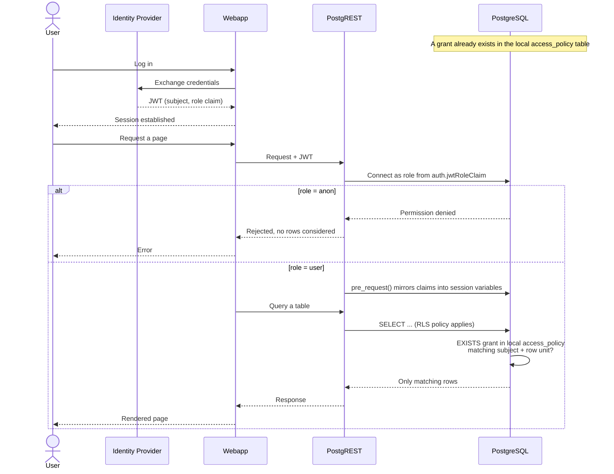

# Security

## Overview

Every request goes through the same four stages:

1. **Authenticate**: a client gets a JWT from your identity provider. The token identifies _who_ is asking, nothing more. The token carries no table grants. The token carries no unit memberships.
2. **Authorize the connection**: PostgREST reads a claim in the JWT (`auth.jwtRoleClaim`). PostgREST maps this claim to a PostgreSQL role. `anon` has no table access. `user` has table access, subject to RLS. `policy_writer_<schema>` has write access to one schema's grants, and no table access. Postgres enforces this mapping with an ordinary `GRANT`/no-`GRANT` check. This check runs before Postgres even considers RLS. Postgres rejects an `anon` token outright. Postgres does not filter an `anon` token's request down to zero rows.
3. **Filter the rows**: for a `user` token, `pre_request()` mirrors every JWT claim into a session variable. Each protected table checks the local `<schema>.access_policy` table. The policy returns a row only when a matching grant exists.
4. **Grant or revoke**: access is data, not configuration. A backend service writes rows in `<schema>.access_policy` through PostgREST. It authenticates as `policy_writer_<schema>`. This role can read, insert, and update only its local policy table. It cannot delete rows. Data Proxy does not compute access decisions. It only enforces policy rows.

Data Proxy never computes access decisions. Data Proxy has no concept of a customer, a permission, or a business rule. Data Proxy checks one generic table before it returns any row.

## Row-Level Security (RLS)

Every protected table checks its rows against its local policy table:

```sql
<schema>.access_policy(subject, is_admin, is_enabled, unit_type, unit_id, metadata)
```

The Helm chart creates one policy table per configured application schema. Each schema also gets one `policy_writer_<schema>` role. This role has access only to that schema's policy table.

`metadata` is one JSONB column. `metadata` holds `created_at` and `updated_at`. `metadata` can also hold any other key a client wants to attach to a grant. A trigger sets `created_at` on every insert. A trigger sets `updated_at` on every insert or update. A client-supplied value for either key is always replaced. Any other key survives the trigger unchanged.

`is_enabled` defaults to `true`. A client can set `is_enabled` to `false` to turn off one grant. This action does not delete the row. A disabled row grants no access. This rule also applies to `is_admin`. A disabled admin row grants no access.

A table opts into RLS by declaring, in its sync configuration, which of its own columns identify a unit of access:

```json
"rls": [
  { "column": "id_cras", "unit_type": "cras" },
  { "column": "id_escola", "unit_type": "escola" }
]
```

At sync time, this becomes one fixed policy per table:

```sql
CREATE POLICY access_policy_scoped ON my_schema.participants
USING (
    'my_schema' = ANY(string_to_array(current_setting('app.claim_schemas', true), ','))
    AND EXISTS (
        SELECT 1 FROM my_schema.access_policy AS p
        WHERE p.subject = current_setting('app.claim_preferred_username', true)
          AND p.is_enabled
          AND (
            p.is_admin
            OR (p.unit_type = 'cras' AND p.unit_id = id_cras::text)
            OR (p.unit_type = 'escola' AND p.unit_id = id_escola::text)
          )
    )
)
```

A row is visible when the requesting subject has an enabled `access_policy` row with `is_admin = true`. A row is also visible when the subject has a matching enabled grant for any of the table's declared units. A user with access to three CRAS units has three rows in `access_policy`. This user does not have three columns on their JWT. A row is visible only when the table's schema also appears in the token's `schemas` claim. See [Schema Scoping](#schema-scoping) below.

## Schema Scoping

Every table checks the requester's `schemas` claim. This claim names every schema that token may reach, as a JWT array or as one comma-separated string. A table with `rls` uses this check. A table with no `rls` also uses this check. `pre_request()` mirrors this claim like any other claim. `pre_request()` joins an array claim into one comma-separated session variable (`app.claim_schemas`). `pre_request()` mirrors a string claim as-is.

A table with no `rls` gets a schema-only policy:

```sql
CREATE POLICY schema_scoped ON my_schema.reference_data
USING (
    'my_schema' = ANY(string_to_array(current_setting('app.claim_schemas', true), ','))
)
```

A table with `rls` combines both checks, as shown above. A request must name the table's schema in its `schemas` claim. A request must also hold a matching `access_policy` grant. Both conditions must pass.

A token can miss the `schemas` claim. A token can also name a different schema. Either case gets zero rows for that table. Neither case returns a permission error. This matches the behavior for an unmatched `access_policy` grant. Each local `<schema>.access_policy` table applies the same schema check to its `user_read` policy. A `user`-role token can read local grant rows only when its `schemas` claim includes that schema.

This check adds one more condition on top of `access_policy`. A table with no `rls` has no other row-level check. A `user`-role token needs the table's schema in its `schemas` claim to read any row from that table. A grant does not change this. A non-`rls` table has no grant to check.

Each schema's `freshness` table uses the same schema-only policy. For example, the token's `schemas` claim must contain `my_schema`. The token can then read `my_schema.freshness`. The policy uses the fixed PostgreSQL schema name. The table does not need a `schema` column.

## Flow

Take a user of a webapp built on top of Data Proxy. This user works at one unit, for example one school.

1. **The user logs in.** The webapp's identity provider checks the user's credentials. The identity provider issues a JWT. The token proves identity: a subject, matching whatever claim the schema reads (for example `preferred_username`). The token also carries a role claim. The token says nothing about which units the user can see. At this point, identity and access are unrelated.
2. **The webapp sends that token to Data Proxy.** Every request to the REST API includes the JWT in the `Authorization` header.
3. **PostgREST picks a PostgreSQL role from the token.** PostgREST reads the role claim (`auth.jwtRoleClaim`). PostgREST connects to Postgres as that role. When the role resolves to `anon`, Postgres rejects the request with a plain permission check. Postgres runs this check before it considers any table or row. When the role resolves to `user`, the connection proceeds and RLS becomes relevant.
4. **`pre_request()` mirrors the token's claims into session variables.** Every claim in the JWT becomes a PostgreSQL session variable for the duration of the request. This includes the identity claim configured for that schema, and the `schemas` claim naming every schema this token may reach.
5. **An access grant already exists, independently of this login.** At some earlier point, for example onboarding or a role change, a backend service wrote one row into the local `<schema>.access_policy` table. This service authenticated as `policy_writer_<schema>`. The row states one subject, one unit type, and one unit ID. This write has nothing to do with login. It can happen before or after a login.
6. **The user's query runs against a table with RLS enabled.** For every row, PostgreSQL evaluates the table policy. PostgreSQL checks the local `<schema>.access_policy` table for a matching subject and unit. It returns only matching rows.
7. **Access changes without touching the login system.** Take the grant from step 5. Someone sets this grant's `is_enabled` to `false`. The very next request reflects that change immediately. No new token is needed. No resync is needed. No cache needs to expire.



## Creating and Granting Access

This section is the practical counterpart to the flow above. It covers two tasks: how to configure the clients Data Proxy cares about, and how to grant an existing end user access to a unit.

### Create a client scope for API access

Before a token reaches PostgREST, Istio checks the token's `aud` (audience) claim against `ingress.auth.audience`. A client without that audience never reaches Postgres, regardless of its role claim. Do not maintain an explicit allow-list of client IDs. Instead, grant this audience through one shared client scope. This way, adding a new client only needs a scope attachment. It needs no Helm or Terraform edit.

1. Create a client scope named `data-proxy` (or similar).
2. Add an **Audience** mapper: **Included Custom Audience** = the value configured in `ingress.auth.audience` (for example `data-proxy`), added to the access token.
3. Add a **Hardcoded claim** mapper: **Token Claim Name** = `auth.jwtRoleClaim`'s configured key (default `role`), **Claim value** = `user`, added to both ID and access tokens.
4. Attach this scope as a **Default Client Scope** to every end-user client that should be able to reach Data Proxy (for example, `app-pic`).

Any client with this scope attached now gets both the required audience and `role: user` automatically.

### Add a client's schemas claim

The shared `data-proxy` scope above is deliberately the same for every end-user client: it only carries the platform audience and `role: user`. The `schemas` claim is different: each end-user client only reaches the schemas its users are meant to see, so it cannot live in that shared scope. Configure it per client instead:

1. On the end-user client itself (for example `app-pic`), add a client-level **Hardcoded claim** mapper (or a **User Attribute** mapper, if different users of the same client reach different schemas): **Token Claim Name** = `schemas`, **Claim JSON Type** = `String`, **Claim value** = one schema name (for example `my_schema`), added to the access token.
2. A client that should reach more than one schema lists every schema name in the same field, separated by commas, with no brackets and no quotes (for example `my_schema,other_schema`). `pre_request()` mirrors a plain string claim as-is. The schema check then splits this string on commas. Some identity providers support a real JSON array claim instead. A real JSON array and a comma-separated string produce the exact same result.

A token can miss this claim. A client can also attach to the wrong schemas. Neither case returns a permission error. Every query against that schema's tables returns zero rows instead. See [Schema Scoping](#schema-scoping).

### Create policy-writer service account

Every schema gets its own writer client, one client per schema, named:

```
data-proxy.policy_writer.<schema>
```

Use the schema name exactly as it appears in `syncConfig.schemas`. Do not change its case. Do not change its characters.

To create it:

1. Create a client named `data-proxy.policy_writer.<schema>`. Mark this client confidential. Enable its service account.
2. On that client's **Mappers** tab, add two client-level mappers. Add both mappers to the access token:
   - `Audience`: **Included Custom Audience** = the same value configured in `ingress.auth.audience` (for example `data-proxy`).
   - `Hardcoded claim`: **Token Claim Name** = `role`, **Claim value** = `policy_writer_<schema>`.

Do not attach the shared `data-proxy` client scope to this client. That scope carries `role: user`. That value would collide with this client's own `role` mapper. Both mappers here stay client-level, not shared. Every value they carry, including the audience, is cheap to repeat on the one client per schema that needs it. A second shared scope, just for the audience, is not worth the added complexity.

### Verify a user's token

A user can log in through `app-pic`, or through whichever end-user client the section above configures. Once the user can log in, verify the resulting token before you grant access:

1. Note the value of the claim configured in `schemas.<schema>.claim` for this user (see [Sync Configuration](sync.md)). For example, when that claim is `preferred_username`, note the user's username. This value is the `subject` you use in `access_policy`.
2. Decode a token from that user. Use `jwt.io`, or use `jq` against the base64-decoded payload. Confirm the token includes all three claims. A decoded payload with `auth.jwtRoleClaim: $.role` and `schemas.my_schema.claim: preferred_username` looks like this:

   ```json
   {
     "iss": "https://idp.example.com/realms/data-proxy",
     "sub": "5f1e2b3a-1234-4c56-9abc-1234567890ab",
     "preferred_username": "123",
     "role": "user",
     "schemas": "my_schema",
     "exp": 1893456000,
     "iat": 1893452400
   }
   ```

   `schemas` can also be a real JSON array, for example `["my_schema"]`. See [Add a client's schemas claim](#add-a-clients-schemas-claim).

   A user reaching more than one schema has every schema name in this same claim. As a comma-separated string, this looks like `"schemas": "my_schema,other_schema"`. As a real JSON array, this looks like `"schemas": ["my_schema", "other_schema"]`.

   `role` must resolve through `auth.jwtRoleClaim` to `user`. `preferred_username` must match the `subject` you use when you grant access below. `schemas` must list `my_schema`. A query against `my_schema` returns zero rows without this entry, even with a valid grant.

### Grant access

`POLICY_WRITER_TOKEN` is a token from the [service account created above](#create-policy-writer-service-account). This token's role claim resolves to `policy_writer_my_schema`, not `user`:

```json
{
  "iss": "https://idp.example.com/realms/data-proxy",
  "sub": "backend-service",
  "role": "policy_writer_my_schema",
  "exp": 1893456000,
  "iat": 1893452400
}
```

This token carries no identity claim to check against `access_policy.subject`. `policy_writer_<schema>` only writes rows. This role never reads rows back through RLS. There is nothing here for `schemas.<schema>.claim` to match.

A backend service writes grants into the local `<schema>.access_policy` table through PostgREST:

```bash
curl --request POST \
  --header "Authorization: Bearer ${POLICY_WRITER_TOKEN}" \
  --header "Content-Type: application/json" \
  --header "Content-Profile: rls" \
  --header "Prefer: resolution=merge-duplicates" \
  --data '[
    {"schema": "my_schema", "subject": "123", "unit_type": "cras", "unit_id": "1"},
    {"schema": "my_schema", "subject": "123", "unit_type": "escola", "unit_id": "55"}
  ]' \
  "${BASE_URL}/access_policy"
```

`Content-Profile: rls` is required. PostgREST now exposes multiple schemas: every configured schema, plus `rls`. Without this header, PostgREST resolves the request against the first schema in `PGRST_DB_SCHEMAS`. PostgREST then returns a "table not found" error.

The request must authenticate as a `policy_writer_<schema>` role. Postgres rejects any row whose `schema` does not match that role's own schema. Postgres enforces this structurally, with no claim parsing involved. A `policy_writer_my_schema` token cannot write a grant for any other schema. `Prefer: resolution=merge-duplicates` makes resending the same grant a safe no-op. A unique constraint on `(schema, subject, unit_type, unit_id)` enforces this.

A row becomes visible to a user when the matching grant exists. `is_enabled` must be `true`. This needs no resync and no token refresh. Each local `access_policy` table is append-only. `policy_writer_<schema>` has no `DELETE` grant on its local table. To revoke access, send a `PATCH` request that sets `is_enabled` to `false`. Do not delete the row:

```bash
curl --request PATCH \
  --header "Authorization: Bearer ${POLICY_WRITER_TOKEN}" \
  --header "Content-Type: application/json" \
  --header "Content-Profile: rls" \
  --data '{"is_enabled": false}' \
  "${BASE_URL}/access_policy?subject=eq.123&unit_type=eq.cras&unit_id=eq.1"
```

A client sets `is_enabled` to `true` again on the same row. This action restores access. The row stays in the table. The row's `created_at` value stays unchanged.

PostgREST applies a `PATCH` to every row that matches the filter, not only one row. Drop `unit_type` and `unit_id` from the filter to disable every grant for one subject in one request:

```bash
curl --request PATCH \
  --header "Authorization: Bearer ${POLICY_WRITER_TOKEN}" \
  --header "Content-Type: application/json" \
  --header "Content-Profile: rls" \
  --data '{"is_enabled": false}' \
  "${BASE_URL}/access_policy?subject=eq.123"
```

This call disables every grant for subject `123` in `my_schema`. `policy_writer_<schema>` only reaches one schema. A subject with grants in more than one schema needs one call per schema.
