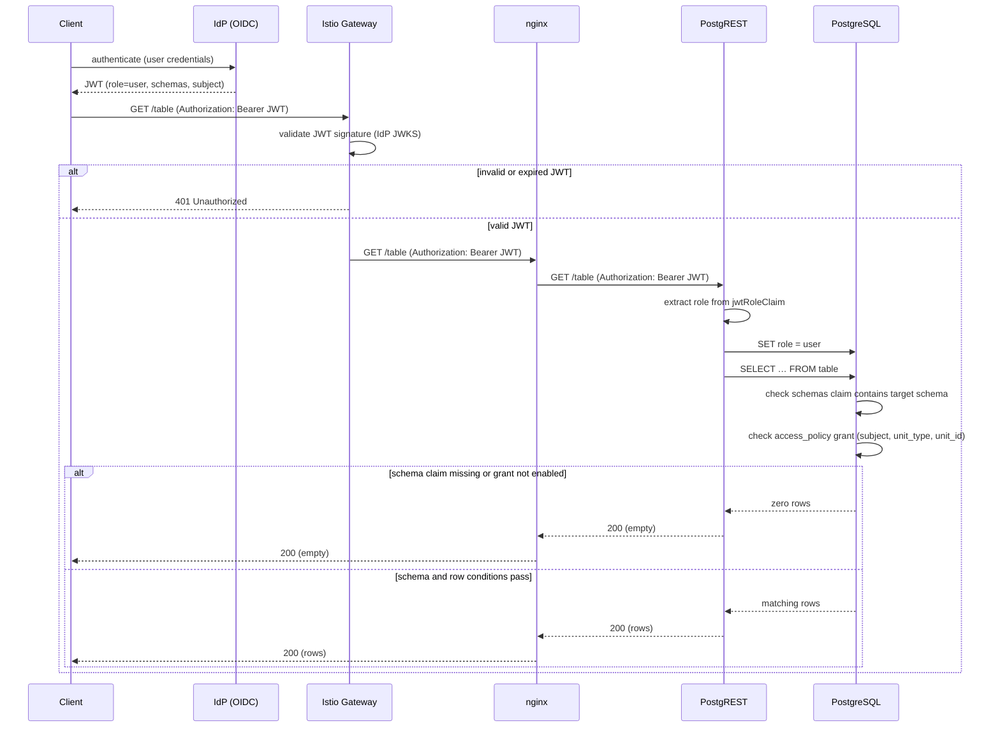

# Security

Data Proxy enforces access in PostgreSQL. It does not calculate business permissions.

## Access model

| Layer            | Rule                                                                      |
| ---------------- | ------------------------------------------------------------------------- |
| JWT role         | PostgREST maps `auth.jwtRoleClaim` to a PostgreSQL role.                  |
| Schema condition | The JWT `schemas` claim must contain the target schema.                   |
| Row condition    | The configured subject claim must match an enabled `access_policy` grant. |
| Policy writer    | `policy_writer_<schema>` writes one schema's grants only.                 |

`anon` has no application table access. `user` can read tables when schema and row conditions pass. `policy_writer_<schema>` can read, insert, and update only `<schema>.access_policy`; it cannot delete.

## Authentication flow



A policy-writer client follows the same path with role `policy_writer_<schema>`. PostgreSQL restricts it to `access_policy` rows in one schema.

## Schema and row conditions

Every application table requires the schema in the `schemas` claim. A table with `rls` also requires a matching enabled grant:

```json
"rls": [
  {"column": "id_cras", "unit_type": "cras"}
]
```

A matching `access_policy` row has:

```text
subject = JWT identity claim
is_enabled = true
is_admin = true OR (unit_type and unit_id match the table row)
```

A missing schema claim or grant returns zero rows. It does not return a permission error.

## Policy writer

Create one confidential service-account client per schema. Its role claim must be:

```text
policy_writer_<schema>
```

Do not give this client the end-user `user` role.

## Grant access

Use a policy-writer token and the target schema profile:

```bash
curl --request POST \
  --header "Authorization: Bearer ${POLICY_WRITER_TOKEN}" \
  --header "Content-Type: application/json" \
  --header "Accept-Profile: my_schema" \
  --header "Prefer: resolution=merge-duplicates" \
  --data '[
    {"subject": "123", "unit_type": "cras", "unit_id": "1"}
  ]' \
  "${BASE_URL}/access_policy"
```

The subject must equal the configured schema claim in the end-user JWT. The user JWT must also list `my_schema` in `schemas`.

## Revoke access

Disable a grant instead of deleting it:

```bash
curl --request PATCH \
  --header "Authorization: Bearer ${POLICY_WRITER_TOKEN}" \
  --header "Content-Type: application/json" \
  --header "Accept-Profile: my_schema" \
  --data '{"is_enabled": false}' \
  "${BASE_URL}/access_policy?subject=eq.123&unit_type=eq.cras&unit_id=eq.1"
```

A later patch with `is_enabled: true` restores the grant. Access changes apply on the next request; no resync or token refresh is needed.

---

[← Previous](using.md) · [Home](../README.md) · [Next →](fallback.md)
