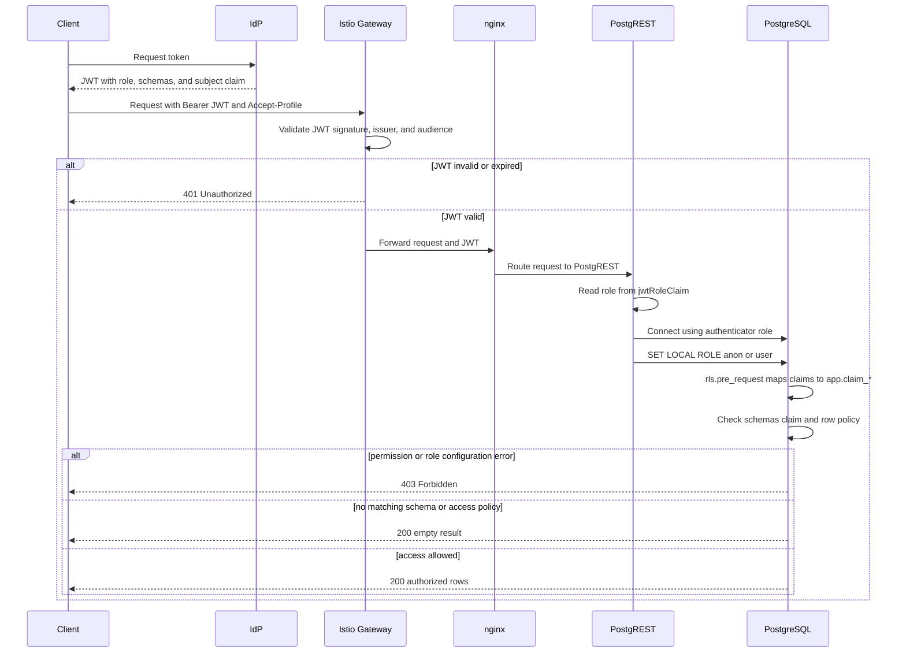
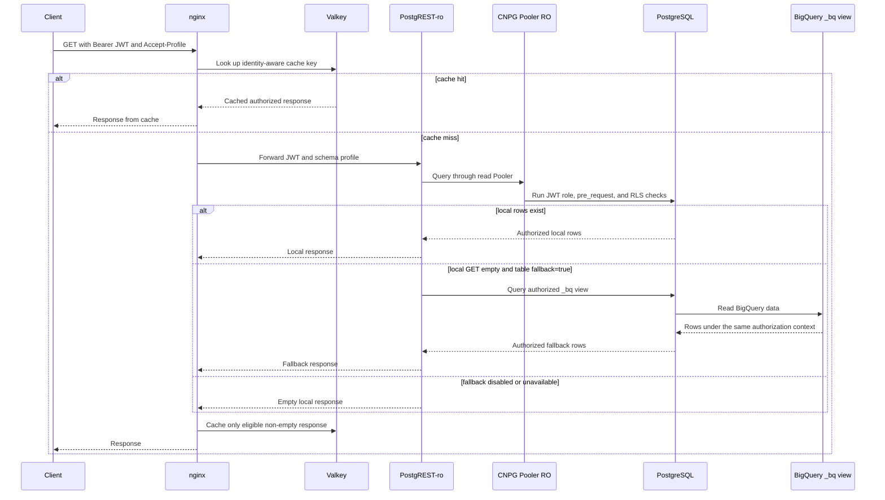

# Security

Data Proxy enforces access in PostgreSQL. It does not calculate business permissions in nginx or in the client.

## Configure the access model

The following values must agree:

```yaml
auth:
  anonRole: anon
  userRole: user
  authenticatorRole: authenticator
  jwtRoleClaim: $.role

syncConfig:
  schemas:
    pic:
      claim: preferred_username
      tables:
        - name: project.dataset.participants
          strategy: full
          rls:
            - column: id_cras
              unit_type: cras
```

These settings mean:

- PostgREST reads the PostgreSQL role from the JWT `role` claim.
- `schemas` must contain `pic`.
- The JWT `preferred_username` value is matched with `access_policy.subject`.
- Rows are visible only when the unit columns match enabled policy rows.

## Required JWT claims

A normal end-user token for the example above contains claims similar to:

```json
{
  "role": "user",
  "schemas": ["pic"],
  "preferred_username": "user-1"
}
```

The exact identity claim is configured per schema. If the schema uses `sub` instead of `preferred_username`, the policy subject must match the token's `sub` value.

The JWT role and RLS flow is:



CNPG manages the core roles:

| Role                     | Purpose                                                                      |
| ------------------------ | ---------------------------------------------------------------------------- |
| `anon`                   | Unauthenticated PostgreSQL role with no application table access.            |
| `user`                   | Authenticated read role, subject to schema and row policies.                 |
| `authenticator`          | PostgREST login role. It is `NOINHERIT` and can switch to `anon` and `user`. |
| `policy_writer_<schema>` | Per-schema policy service role.                                              |
| `backup`                 | Optional role for access-policy backups.                                     |

Init-db creates the `rls` schema and its functions, tables, policies, and grants. `rls.pre_request()` copies JWT claims into transaction-local PostgreSQL settings. `USAGE` on `rls` does not grant application table access.

## Schema and row authorization

Authorization has two independent conditions.

### Schema condition

The token must list the requested schema:

```json
"schemas": ["pic"]
```

The client must select the same schema:

```http
Accept-Profile: pic
```

### Row condition

For a table with this configuration:

```json
"rls": [
  {"column": "id_cras", "unit_type": "cras"}
]
```

an enabled policy row must match the user's subject and the row's unit:

```text
subject   = JWT preferred_username (or configured claim)
is_enabled = true
is_admin   = true
OR unit_type/unit_id matches the row
```

A missing schema claim or policy grant normally returns `200 []`. It is not an authentication failure.

## Seed access policy

Create one confidential policy-writer client per schema. Its JWT role must be:

```text
policy_writer_pic
```

Do not grant this client the normal `user` role. The policy-writer role can read, insert, and update only `pic.access_policy`; it cannot delete policy rows or read application tables.

Use a policy-writer token and the target schema profile:

```bash
curl --request POST \
  --header "Authorization: Bearer ${POLICY_WRITER_TOKEN}" \
  --header "Content-Type: application/json" \
  --header "Accept-Profile: pic" \
  --header "Prefer: resolution=merge-duplicates" \
  --data '[
    {"subject": "user-1", "unit_type": "cras", "unit_id": "cras_1"}
  ]' \
  "${BASE_URL}/access_policy"
```

The policy subject must equal the configured identity claim in the end-user JWT.

### Revoke access

Disable a grant instead of deleting it:

```bash
curl --request PATCH \
  --header "Authorization: Bearer ${POLICY_WRITER_TOKEN}" \
  --header "Content-Type: application/json" \
  --header "Accept-Profile: pic" \
  --data '{"is_enabled": false}' \
  "${BASE_URL}/access_policy?subject=eq.user-1&unit_type=eq.cras&unit_id=eq.cras_1"
```

A later patch with `is_enabled: true` restores the grant. No resync or token refresh is required.

## Read requests and fallback

Use a normal end-user token:

```bash
curl \
  --header "Authorization: Bearer ${USER_TOKEN}" \
  --header "Accept-Profile: pic" \
  "${BASE_URL}/participants?limit=20"
```

Nginx routes reads to PostgREST-ro and writes to PostgREST-rw. Fallback does not bypass authentication or RLS:



See [Fallback](fallback.md) for cache and fallback rules. `/access_policy` is never response-cached.

## Expected HTTP results

| Result          | Meaning                                                                   |
| --------------- | ------------------------------------------------------------------------- |
| `200` with rows | Token, schema, role, grants, and RLS checks passed.                       |
| `200 []`        | The request is valid, but the schema claim or row policy exposes no rows. |
| `401`           | The JWT is missing, invalid, expired, or cannot be used by PostgREST.     |
| `403`           | PostgreSQL/PostgREST permission or role configuration is invalid.         |
| `404`           | The schema profile or requested resource is unknown.                      |

## Troubleshooting

| Symptom                                       | Check                                                                                                    |
| --------------------------------------------- | -------------------------------------------------------------------------------------------------------- |
| `401 Unauthorized`                            | Check the JWT signature, issuer, audience, expiry, and `role` claim.                                     |
| `403` with `permission denied to set role`    | Check that CNPG manages `authenticator` with `inRoles: [anon, user]` and `inherit: false`.               |
| `403` with `permission denied for schema rls` | Check `GRANT USAGE ON SCHEMA rls TO anon/user`.                                                          |
| `200 []` for every table                      | Check `schemas`, the schema profile, the configured subject claim, and enabled `access_policy` rows.     |
| `404 Unknown schema profile`                  | Check `Accept-Profile` and `syncConfig.schemas`.                                                         |
| Policy write fails                            | Use the exact `policy_writer_<schema>` role and matching `Accept-Profile`; do not use the end-user role. |
| Local and fallback results differ             | Check `X-Source` and `X-Cache`; fallback uses the same JWT and RLS rules.                                |
| `/access_policy` appears cached               | It must never be cached. Check nginx configuration and response headers.                                 |

See [Using the API](using.md), [Database Schema](database.md), and [Fallback](fallback.md) for related details.

---

[← Previous](using.md) · [Home](../README.md) · [Next →](fallback.md)
