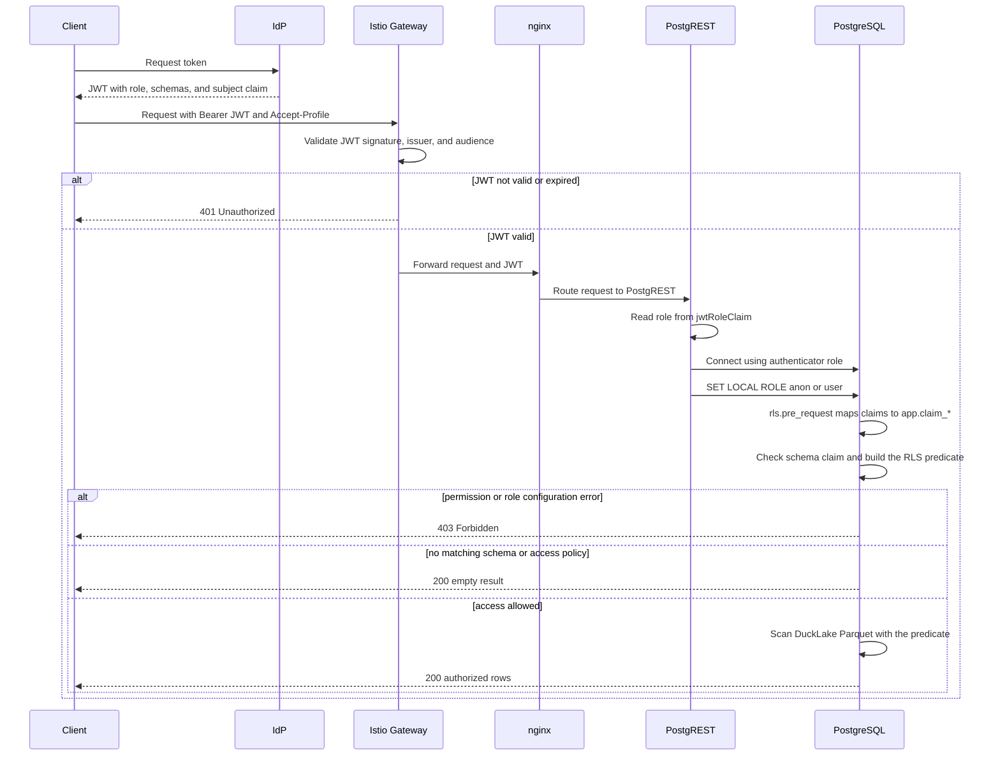
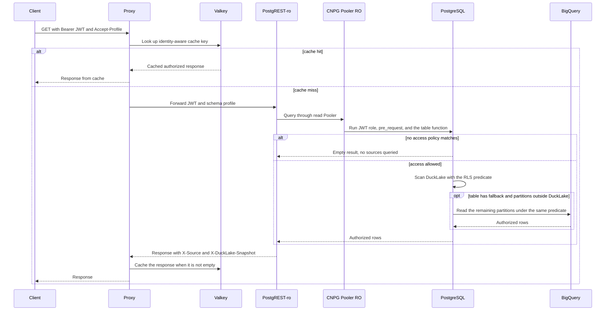

# Security

Data Proxy enforces access in PostgreSQL and pushes the resulting predicate into DuckDB. It does not calculate business permissions in nginx or in the client.

## Configure the access model

The following values must agree:

```yaml
auth:
  anonRole: anon
  userRole: user
  authenticatorRole: authenticator
  jwtRoleClaim: $.role

syncConfig:
  schemas:
    test:
      claim: preferred_username
      tables:
        - name: project.dataset.participants
          strategy: full
          rls:
            - column: region_id
              unit_type: region
```

These settings mean:

- PostgREST reads the PostgreSQL role from the JWT `role` claim.
- `schemas` must contain `test`.
- The JWT `preferred_username` value is matched with `access_policy.subject`.
- Rows are visible only when the unit columns match enabled policy rows.

## Required JWT claims

A normal end-user token for the example above contains claims similar to:

```json
{
  "role": "user",
  "schemas": ["test"],
  "preferred_username": "test_user_1"
}
```

The exact identity claim is configured per schema. If the schema uses `sub` instead of `preferred_username`, the policy subject must match the token's `sub` value.

The JWT role and RLS flow is:


```mermaid
sequenceDiagram
    participant C as Client
    participant I as IdP
    participant G as Istio Gateway
    participant N as nginx
    participant P as PostgREST
    participant DB as PostgreSQL

    C->>I: Request token
    I-->>C: JWT with role, schemas, and subject claim
    C->>G: Request with Bearer JWT and Accept-Profile
    G->>G: Validate JWT signature, issuer, and audience
    alt JWT not valid or expired
        G-->>C: 401 Unauthorized
    else JWT valid
        G->>N: Forward request and JWT
        N->>P: Route request to PostgREST
        P->>P: Read role from jwtRoleClaim
        P->>DB: Connect using authenticator role
        P->>DB: SET LOCAL ROLE anon or user
        DB->>DB: rls.pre_request maps claims to app.claim_*
        DB->>DB: Check schema claim and build the RLS predicate
        alt permission or role configuration error
            DB-->>C: 403 Forbidden
        else no matching schema or access policy
            DB-->>C: 200 empty result
        else access allowed
            DB->>DB: Scan DuckLake Parquet with the predicate
            DB-->>C: 200 authorized rows
        end
    end
```

CNPG manages the core roles:

| Role                     | Purpose                                                                        |
| ------------------------ | ------------------------------------------------------------------------------ |
| `anon`                   | Unauthenticated PostgreSQL role with no application table access.              |
| `user`                   | Authenticated read role, subject to schema and row policies.                   |
| `authenticator`          | PostgREST login role. It's `NOINHERIT` and can switch to `anon` and `user`.    |
| `policy_writer_<schema>` | Per-schema policy service role.                                                |
| `jobs`                   | Shared maintenance role for the backup and cleanup CronJobs. It can't run DDL. |

Init-db creates the `rls` schema and its functions, tables, policies, and grants. `rls.pre_request()` copies JWT claims into transaction-local PostgreSQL settings. `USAGE` on `rls` doesn't grant application table access.

## Schema and row authorization

Authorization has two independent conditions.

### Schema condition

The token must list the requested schema:

```json
"schemas": ["test"]
```

The client must select the same schema:

```http
Accept-Profile: test
```

### Row condition

For a table with this configuration:

```json
"rls": [
  {"column": "region_id", "unit_type": "region"}
]
```

an active policy row must match the user's subject and the row's unit:

```text
subject   = JWT preferred_username (or configured claim)
OR unit_type/unit_id matches the row
```

A policy row exists only while the grant is active. Revoking access deletes the row. A missing schema claim or policy grant normally returns `200 []`. It isn't an authentication error.

## Seed access policy

Create one confidential policy-writer client per schema. Its JWT role must be:

```text
policy_writer_test
```

Don't grant this client the normal `user` role. The policy-writer role can select, insert, update, and delete rows in `test.access_policy` only, and can't read application tables. Deleting a row revokes the grant; the change is recorded in `test.access_log`.

Use a policy-writer token and the target schema profile:

```bash
curl --request POST \
  --header "Authorization: Bearer ${POLICY_WRITER_TOKEN}" \
  --header "Content-Type: application/json" \
  --header "Accept-Profile: test" \
  --header "Prefer: resolution=merge-duplicates" \
  --data '[
    {"subject": "test_user_1", "unit_type": "region", "unit_id": "region_1"}
  ]' \
  "${BASE_URL}/access_policy"
```

The policy subject must equal the configured identity claim in the end-user JWT.

### Revoke access

Delete the grant:

```bash
curl --request DELETE \
  --header "Authorization: Bearer ${POLICY_WRITER_TOKEN}" \
  --header "Accept-Profile: test" \
  "${BASE_URL}/access_policy?subject=eq.test_user_1&unit_type=eq.region&unit_id=eq.region_1"
```

The row is removed from `test.access_policy` and its previous state is written to `test.access_log` with `action = 'delete'`. To grant access again, insert the row again. No resync or token refresh is required.

## Read requests

Use a normal end-user token:

```bash
curl \
  --header "Authorization: Bearer ${USER_TOKEN}" \
  --header "Accept-Profile: test" \
  "${BASE_URL}/participants?limit=20"
```

The proxy routes reads to PostgREST-ro and writes to PostgREST-rw. BigQuery rows follow the same authentication and RLS rules as DuckLake rows:


```mermaid
sequenceDiagram
    participant C as Client
    participant N as Proxy
    participant R as Valkey
    participant P as PostgREST-ro
    participant RP as CNPG Pooler RO
    participant DB as PostgreSQL
    participant BQ as BigQuery

    C->>N: GET with Bearer JWT and Accept-Profile
    N->>R: Look up identity-aware cache key
    alt cache hit
        R-->>N: Cached authorized response
        N-->>C: Response from cache
    else cache miss
        N->>P: Forward JWT and schema profile
        P->>RP: Query through read Pooler
        RP->>DB: Run JWT role, pre_request, and the table function
        alt no access policy matches
            DB-->>P: Empty result, no sources queried
        else access allowed
            DB->>DB: Scan DuckLake with the RLS predicate
            opt table has fallback and partitions outside DuckLake
                DB->>BQ: Read the remaining partitions under the same predicate
                BQ-->>DB: Authorized rows
            end
            DB-->>P: Authorized rows
        end
        P-->>N: Response with X-Source and X-DuckLake-Snapshot
        N->>R: Cache the response when it is not empty
        N-->>C: Response
    end
```

See [Proxy](proxy.md) for the routing and cache rules. `/access_policy` is never response-cached.

## Expected results

| Result          | Meaning                                                                   |
| --------------- | ------------------------------------------------------------------------- |
| `200` with rows | Token, schema, role, grants, and RLS checks passed.                       |
| `200 []`        | The request is valid, but the schema claim or row policy exposes no rows. |
| `401`           | The JWT is missing, not valid, expired, or can't be used by PostgREST.    |
| `403`           | PostgreSQL/PostgREST permission or role configuration isn't valid.        |
| `404`           | The schema profile or requested resource is unknown.                      |

## Troubleshooting

| Symptom                                       | Check                                                                                                   |
| --------------------------------------------- | ------------------------------------------------------------------------------------------------------- |
| `401 Unauthorized`                            | Check the JWT signature, issuer, audience, expiry, and `role` claim.                                    |
| `403` with `permission denied to set role`    | Check that CNPG manages `authenticator` with `inRoles: [anon, user]` and `inherit: false`.              |
| `403` with `permission denied for schema rls` | Check `GRANT USAGE ON SCHEMA rls TO anon/user`.                                                         |
| `200 []` for every table                      | Check `schemas`, the schema profile, the configured subject claim, and enabled `access_policy` rows.    |
| `404 Unknown schema profile`                  | Check `Accept-Profile` and `syncConfig.schemas`.                                                        |
| Policy write fails                            | Use the exact `policy_writer_<schema>` role and matching `Accept-Profile`; don't use the end-user role. |
| Results differ between requests               | Check `X-Source`, `X-DuckLake-Snapshot`, and `X-Cache`; every source uses the same JWT and RLS rules. |
| `/access_policy` appears cached               | It must never be cached. Check nginx configuration and response headers.                                |

See [Using the API](using.md), [Database Schema](database.md), and [Proxy](proxy.md) for related details.

---

[← Previous](using.md) · [Home](../README.md) · [Next →](proxy.md)
